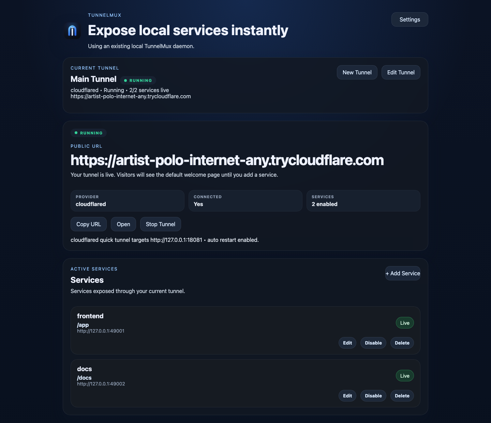

# TunnelMux

[English](README.md) | [简体中文](README.zh-CN.md)


TunnelMux is a GUI-first local tunnel control console for developers who are tired of juggling `cloudflared`, `ngrok`, route scripts, and half-broken local demos.

If your project now means “frontend + API + docs + callback endpoint” instead of one localhost port, TunnelMux gives you one place to start tunnels, expose services, switch providers, and see what is actually broken.



## Why people reach for TunnelMux

Modern local sharing gets messy fast:

- vibe coding turns one app into multiple local services in a day
- ad-hoc `cloudflared` / `ngrok` commands become tribal knowledge
- path and host routing drifts across scripts, shell history, and README snippets
- when something fails, it is hard to tell whether the problem is the daemon, the tunnel, the route, or the local service
- teammates cannot reliably reproduce the same local exposure setup

TunnelMux keeps that workflow in one local control plane instead of another pile of terminal glue.

## What you get

- A desktop GUI for the common path: create a tunnel, click start, add services
- One daemon and one API behind both the GUI and CLI
- Multi-service host/path routing for local apps, APIs, docs, and callbacks
- Provider-aware tunnel setup for `cloudflared` and `ngrok`
- Runtime status, public URL, and service state in one place
- Route health, provider logs, and diagnostics when you need them
- Service access gates with a global default code plus per-service inherit/custom/public modes
- In-app update checks against GitHub Releases with SHA256-verified raw archive installs
- Declarative `config.json` hot reload for route and health-check changes

## GUI-first workflow

TunnelMux is designed for the “I just need this working” path first:

1. Create a tunnel profile
2. Pick `cloudflared` or `ngrok`
3. Click `Start Tunnel`
4. Add one or more local services
5. Share the public URL

When you need more control, the same app also supports:

- multiple tunnel profiles
- provider-specific configuration
- tunnel-scoped services
- tunnel restart / recovery
- diagnostics and log inspection on demand

## Install

### Fastest path: native GUI installer

Download the latest installer from GitHub Releases:

- macOS: `.dmg`
- Windows: `.msi`
- Linux: `.deb`

Releases also include raw platform archives with:

- `tunnelmuxd`
- `tunnelmux-cli`
- `tunnelmux-gui`

The desktop GUI can also check GitHub Releases from Settings → App Updates. It reads the static `tunnelmux-latest.json` release manifest first and falls back to the GitHub API only when needed. When a newer matching raw archive is available, it shows the asset and SHA256 before install, downloads to `~/.tunnelmux/updates/<version>/`, verifies `SHA256SUMS` when present, installs the bundled binaries beside the current app executable, and enables **Restart Now**.

### One-command installer

macOS and Linux:

```bash
curl -fsSL https://raw.githubusercontent.com/kexuejin/TunnelMux/main/scripts/install.sh | bash
```

Examples:

```bash
# Pin a version
curl -fsSL https://raw.githubusercontent.com/kexuejin/TunnelMux/main/scripts/install.sh | bash -s -- --version v0.2.0

# Install into /usr/local/bin
curl -fsSL https://raw.githubusercontent.com/kexuejin/TunnelMux/main/scripts/install.sh | bash -s -- --prefix /usr/local
```

### Build from source

```bash
cargo install --git https://github.com/kexuejin/TunnelMux tunnelmuxd --locked
cargo install --git https://github.com/kexuejin/TunnelMux tunnelmux-cli --locked
```

For local development:

```bash
cargo run -p tunnelmuxd
cargo run -p tunnelmux-gui
```

## Quick start

### GUI path

1. Install `cloudflared` or `ngrok`
2. Open TunnelMux
3. Create your first tunnel
4. Click `Start Tunnel`
5. Add your local service URL, for example `http://127.0.0.1:3000`

The GUI prefers to connect to an existing local `tunnelmuxd`. If nothing is reachable, it can auto-start a local daemon for the desktop app.

If the selected provider is not installed yet, TunnelMux now catches that before launch, shows a provider-specific warning on the main page, and offers a `Copy Install Command` action for the current tunnel instead of surfacing a raw spawn error.

### CLI path

```bash
git clone https://github.com/kexuejin/TunnelMux.git
cd TunnelMux

cargo run -p tunnelmuxd -- \
  --listen 127.0.0.1:4765 \
  --gateway-listen 127.0.0.1:18080

cargo run -p tunnelmux-cli -- routes add \
  --id app-web \
  --upstream-url http://127.0.0.1:3000 \
  --path-prefix /app

cargo run -p tunnelmux-cli -- tunnel start \
  --provider cloudflared \
  --target-url http://127.0.0.1:18080 \
  --auto-restart
```

## Supported local workflow

TunnelMux is a good fit when you need to expose:

- a frontend on one path and an API on another
- docs, webhook callbacks, and local tools behind one tunnel
- a stable named Cloudflare tunnel or a quick temporary tunnel
- one tunnel today, then multiple tunnel profiles later

It is not trying to be your production edge or cloud platform. It is the local control layer that makes local sharing less annoying.

## macOS first-launch FAQ

Current native GUI installers may still be unsigned, so macOS can show Gatekeeper warnings on first launch.

### “TunnelMux is damaged and can’t be opened”

If you trust the download source:

1. Open Finder and locate the app
2. Right-click `TunnelMux.app`
3. Click `Open`
4. Confirm the trust prompt

If macOS still blocks it, go to:

- `System Settings` → `Privacy & Security`
- find the blocked app notice near the bottom
- click `Open Anyway`

### “Apple cannot verify the developer”

Use the same sequence first:

1. Right-click the app
2. Click `Open`
3. Confirm the dialog

If needed:

- `System Settings` → `Privacy & Security`
- click `Open Anyway`

### Last resort: remove quarantine

Only do this if you trust the source of the app:

```bash
xattr -dr com.apple.quarantine /Applications/TunnelMux.app
```

More release and bundle details live in `docs/RELEASING.md`.

## Config files

- `~/.tunnelmux/config.json` — declarative routes and health-check settings
- `~/.tunnelmux/state.json` — daemon-owned runtime snapshot
- `~/.tunnelmux/api-token` — auto-generated control-plane bearer token (0600)

The daemon polls `config.json` and applies route and health-check changes without restarting.

## Service access gates

Public tunnel routes can be protected before traffic reaches the upstream service. Configure a default service access code in Settings → Default service access, then choose a per-service mode in the service drawer:

- `Inherit default gate` — use the default code when one is configured
- `Use custom service code` — require a service-specific code
- `Always public` — opt the service out of the default gate

The daemon stores the default gate in `default_route_access` and route overrides in `route_access.<route_id>` inside `~/.tunnelmux/state.json`. Successful browser unlocks use route-scoped cookies such as `tunnelmux_access_<route_id>`, so protecting one service does not open unrelated routes.

For mounted SPAs such as DeepSeek Harness, use the **DeepSeek / SPA Preset** in the service editor. It sets a path mount, keeps Host forwarding off, enables response path rewriting, and reminds you that root `/` stays closed unless another service explicitly exposes it. Each service card also has **Test** to check the public route and upstream status.

## Security

The control-plane API (`127.0.0.1:4765`) authenticates with a bearer token.
`--control-auth` selects the mode: `require` (default), `optional`, or `off`.
In `require` mode all protected endpoints demand a valid token; when none is
configured the daemon generates one into `~/.tunnelmux/api-token`. The CLI and
GUI (and `dsh-tunnelmux-remote`) auto-read that token, so local tools keep
working unchanged. `GET /v1/health` is always unauthenticated.

You can also **unlock loopback** with a human-enterable access code
(`--unlock-code <CODE>` or auto-rotated when unset; default window 4h,
`--unlock-window <ms>`). While unlocked, local requests pass without a token;
non-loopback (e.g. bridged) access still requires the bearer token. Use
`tunnelmux unlock <code>` / `tunnelmux unlock --show-code` / `--relock`, or the
GUI under Settings → Control-plane access.

## Docs

- [Architecture](docs/ARCHITECTURE.md)
- [API](docs/API.md)
- [Third-Party Integration](docs/INTEGRATION.md)
- [Integration Templates](docs/INTEGRATION-TEMPLATES.md)
- [Roadmap](docs/ROADMAP.md)
- [Releasing](docs/RELEASING.md)
- [Changelog](CHANGELOG.md)

## Repository layout

- `crates/tunnelmux-core` — shared domain models and protocol types
- `crates/tunnelmux-control-client` — shared HTTP control client for CLI and GUI
- `crates/tunnelmuxd` — daemon runtime and control-plane API
- `crates/tunnelmux-cli` — CLI client and operational commands
- `crates/tunnelmux-gui` — Tauri desktop control console
- `scripts/install.sh` — installer for macOS/Linux

## Contributing

- [Contributing Guide](CONTRIBUTING.md)
- [Code of Conduct](CODE_OF_CONDUCT.md)
- [Security Policy](SECURITY.md)
