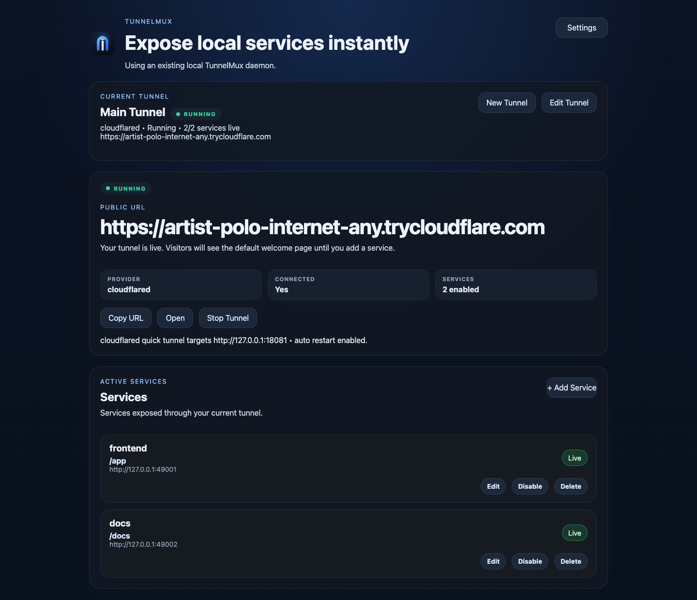

# TunnelMux

[English](README.md) | [简体中文](README.zh-CN.md)


TunnelMux 是一个面向开发者的本地隧道控制台，优先提供 GUI 体验，用来替代散落在终端里的 `cloudflared`、`ngrok`、路由脚本和各种临时命令。

当你的本地开发已经不是“只暴露一个 3000 端口”，而是“前端 + API + 文档 + 回调服务”一起跑时，TunnelMux 用一个本地控制面把隧道启动、服务暴露、Provider 切换和故障排查收拢到一起。



## 为什么会需要 TunnelMux

现在的本地分享链路很容易失控：

- vibe coding 一天内就能把一个项目拆成多个本地服务
- `cloudflared` / `ngrok` 命令靠手敲，维护成本越来越高
- host/path 路由散落在 shell history、脚本和 README 片段里
- 出问题时很难判断到底是 daemon、tunnel、route 还是本地服务坏了
- 团队成员很难复现同一套本地暴露配置

TunnelMux 的目标不是再造一个平台，而是把这些本地暴露动作收敛成一个可控的本地控制面。

## 你能得到什么

- 一个覆盖主路径的桌面 GUI：建 tunnel、点启动、加服务
- 一个同时服务 GUI 和 CLI 的 daemon / API
- 面向本地多服务的 host/path 路由能力
- 支持 `cloudflared` 和 `ngrok` 的 provider 配置
- 公网地址、服务状态、连接状态放在一个页面里
- 需要时再展开的诊断、日志和健康状态
- 基于 `config.json` 的路由与健康检查热重载

## GUI 优先的使用方式

TunnelMux 先服务最常见的路径：

1. 创建一个 tunnel
2. 选择 `cloudflared` 或 `ngrok`
3. 点击 `Start Tunnel`
4. 添加一个或多个本地服务
5. 直接分享公网地址

如果后面需要更复杂的能力，同一个应用也支持：

- 多 tunnel profile
- provider 专属配置
- tunnel 级别的服务管理
- tunnel 重启 / 恢复
- 按需查看诊断和日志

## 安装

### 最快路径：原生 GUI 安装包

可以直接从 GitHub Releases 下载：

- macOS：`.dmg`
- Windows：`.msi`
- Linux：`.deb`

同时也提供原始平台压缩包，包含：

- `tunnelmuxd`
- `tunnelmux-cli`
- `tunnelmux-gui`

### 一行命令安装

macOS / Linux：

```bash
curl -fsSL https://raw.githubusercontent.com/kexuejin/TunnelMux/main/scripts/install.sh | bash
```

示例：

```bash
# 固定版本
curl -fsSL https://raw.githubusercontent.com/kexuejin/TunnelMux/main/scripts/install.sh | bash -s -- --version v0.2.0

# 安装到 /usr/local/bin
curl -fsSL https://raw.githubusercontent.com/kexuejin/TunnelMux/main/scripts/install.sh | bash -s -- --prefix /usr/local
```

### 从源码运行

```bash
cargo install --git https://github.com/kexuejin/TunnelMux tunnelmuxd --locked
cargo install --git https://github.com/kexuejin/TunnelMux tunnelmux-cli --locked
```

本地开发：

```bash
cargo run -p tunnelmuxd
cargo run -p tunnelmux-gui
```

## 快速开始

### GUI 路径

1. 安装 `cloudflared` 或 `ngrok`
2. 打开 TunnelMux
3. 创建第一个 tunnel
4. 点击 `Start Tunnel`
5. 添加本地服务地址，例如 `http://127.0.0.1:3000`

GUI 会优先连接已有的本地 `tunnelmuxd`。如果当前不可用，它也可以为桌面应用自动拉起一个本地 daemon。

如果当前所选 provider 还没有安装，TunnelMux 现在会在启动前先拦截这个问题，在主界面给出对应 provider 的提示，并提供 `Copy Install Command` 操作，避免直接落到原始的进程启动报错。

### CLI 路径

```bash
git clone https://github.com/kexuejin/TunnelMux.git
cd TunnelMux

cargo run -p tunnelmuxd -- \
  --listen 127.0.0.1:4765 \
  --gateway-listen 127.0.0.1:18080

cargo run -p tunnelmux-cli -- routes add \
  --id app-web \
  --upstream-url http://127.0.0.1:3000 \
  --path-prefix /app

cargo run -p tunnelmux-cli -- tunnel start \
  --provider cloudflared \
  --target-url http://127.0.0.1:18080 \
  --auto-restart
```

## 适合哪些场景

TunnelMux 很适合这些本地开发场景：

- 前端走一个路径，API 走另一个路径
- 文档、Webhook 回调、本地工具挂在同一个 tunnel 下
- 想用稳定的 Cloudflare named tunnel，或者临时 quick tunnel
- 默认只需要一个 tunnel，后面再逐步增加多个 tunnel profile

它不是生产环境边缘网关，也不是云平台。它更像是本地分享链路上的控制层，用来降低使用成本。

## macOS 首次打开 FAQ

当前原生 GUI 安装包可能仍是未签名状态，因此第一次启动时，macOS 可能会弹出 Gatekeeper 提示。

### “App 已损坏，无法打开”

如果你确认下载来源可信，可以按下面操作：

1. 在 Finder 中找到应用
2. 右键 `TunnelMux.app`
3. 点击 `打开`
4. 在系统弹窗里确认

如果仍然被拦截，再到：

- `系统设置` → `隐私与安全性`
- 在页面底部找到被拦截的应用提示
- 点击 `仍要打开`

### “无法验证开发者”

优先还是走同一套流程：

1. 右键应用
2. 选择 `打开`
3. 在弹窗里确认

如果还是不行：

- `系统设置` → `隐私与安全性`
- 点击 `仍要打开`

### 最后手段：移除 quarantine

只在你确认应用来源可信时再执行：

```bash
xattr -dr com.apple.quarantine /Applications/TunnelMux.app
```

更多发布与打包说明见 `docs/RELEASING.md`。

## 配置文件

- `~/.tunnelmux/config.json` — 声明式路由与健康检查配置
- `~/.tunnelmux/state.json` — daemon 维护的运行时快照

daemon 会轮询 `config.json`，应用路由和健康检查变更时不需要重启。

## 文档

- [Architecture](docs/ARCHITECTURE.md)
- [API](docs/API.md)
- [Third-Party Integration](docs/INTEGRATION.md)
- [Integration Templates](docs/INTEGRATION-TEMPLATES.md)
- [Roadmap](docs/ROADMAP.md)
- [Releasing](docs/RELEASING.md)
- [Changelog](CHANGELOG.md)

## 仓库结构

- `crates/tunnelmux-core` — 共享领域模型与协议类型
- `crates/tunnelmux-control-client` — GUI / CLI 共用的 HTTP 控制客户端
- `crates/tunnelmuxd` — daemon 运行时与控制面 API
- `crates/tunnelmux-cli` — CLI 客户端与运维命令
- `crates/tunnelmux-gui` — Tauri 桌面控制台
- `scripts/install.sh` — macOS / Linux 安装脚本

## 参与贡献

- [Contributing Guide](CONTRIBUTING.md)
- [Code of Conduct](CODE_OF_CONDUCT.md)
- [Security Policy](SECURITY.md)
